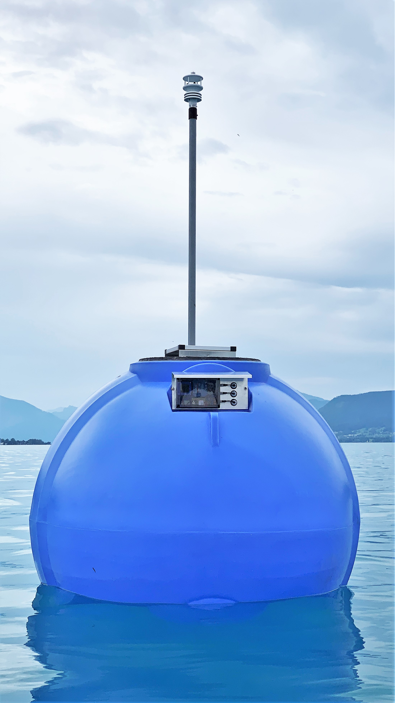

# Weather Buoy - ESP32 4G/LTE Solar
* On-water solar powered autonomous wind and weather station
* ESP32, SIM7600E, GILL MaxiMet GMX501

 

 

## Electronics part list

| Part | Description | Links | Cost (ex. delivery) |
|-|-|-|-|
| Waterproof housing | Fibox PCM200/100T, 255x180x100 Polycarbonat | [Fibox 6016927](https://www.fibox.de//catalog/64/product/183/6016927_GER1.html), [conrad](https://www.conrad.at/de/p/fibox-pcm-200-100-t-6016927-universal-gehaeuse-255-x-180-x-100-polycarbonat-lichtgrau-ral-7035-1-st-521203.html) | EUR 46 |
| Weather station | Gill MaxiMet: ultrasonic windspeed/direction, compass, solar radiation | [GILL MaxiMet GMX501](http://gillinstruments.com/data/datasheets/1957-009%20Maximet-gmx501%20Iss%207.pdf) | EUR 3000 |
| Microcontroller |  Lilygo ESP32 | [LILYGO® TTGO T-PCIE ESP32-WROVER-B](http://www.lilygo.cn/prod_view.aspx?TypeId=50044&Id=1313&FId=t3:50044:3) | EUR 10 |
| 4G/LTE Modem  | SimCom 7600 | [PCIE-SIM7600E Module](http://www.lilygo.cn/prod_view.aspx?TypeId=50044&Id=1313&FId=t3:50044:3)  |  EUR 30 |
| Solar panel | 12V, 20W, monocrystalline, water proof IP65 | [Offgridtec](https://www.offgridtec.com/en/offgridtec-20w-mono-solarpanel-12v.html)| EUR 27 |
| Solar charging controller 12V | LiFePo4 capable, 5V power for microcontroller | [Victron Bluesolar, MPPT, 75/10](https://www.victronenergy.com/solar-charge-controllers/mppt7510) | EUR 80 |
| RS232 to TTL converter | MAX3232 to convert weatherstation's RS232 to 3.3V serial | [Sparkfun MAX3232 tranceiver breakout](https://www.sparkfun.com/products/11189) | EUR 5 |
| Voltage/Current sensor | MAX471 module, uses ESP32 ADC as there is no serial available to connect the ESP32 to the Victron Solar charger  | [MAX471 module with voltage divider](https://www.aliexpress.com/w/wholesale-max471-module.html), [MAX471 datasheet](https://www.maximintegrated.com/en/products/analog/amplifiers/MAX471.html) | ~EUR 2 |
| Water Temperature sensor | DS18B20 cable | [DS18B20 cable](https://www.az-delivery.de/en/products/2er-set-ds18b20-mit-3m-kabel?variant=19385240518752) | ~EUR 3 |
| On-Board Temperature sensor | DS18B20 TSO module | [DS18B20 TSO](https://www.az-delivery.de/en/products/5ersetds18b20?_pos=2&_sid=9a9ed3862&_ss=r) | ~EUR 1
| Battery | LiFePo4, 12V, 6Ah, 4S1P, including BMS | [Jubatec](https://www.jubatec.net/lifepo4-akku-12v-6ah-mit-bms-batterie-management-system_4652) | EUR 60 |
| 5V Power | convert ~14V Battery voltage to 5V for ESP32 |  [TracoPower TSR 1-2450 DC/DC-Wandler, 24V/DC 5V/DC 1A 6W](https://www.tracopower.com/int/model/tsr-1-2450) | EUR 6 |
| M12 male front-mount | Solar panel power, 4-pins, 2 pins combined to double current of 4A per pin | [7000-13501-9710050](https://shop.murrelektronik.de/en/Connection-Technology/Flange-Connectors/Signal/M12-male-receptacle-A-cod-front-mount-7000-13501-9710050.html?listtype=search&searchparam=7000-13501-9710050) | EUR 10 |
| M12 female with cable | Solar panel power, 4-pins, 2 pins combined to double current of 4A per pin, soldered to solar panel | [7000-12221-6340200](https://shop.murrelektronik.de/en/Connection-Technology/With-open-ended-wires/Signal/M12-female-0-with-cable-7000-12221-6340200.html?listtype=search&searchparam=7000-12221-6340200&src=search&srchPage=1&perPage=10&pos=1) | EUR 10 |
| M8 male connector | soldered to Water temperature sensor cable | [7000-08401-0000000](https://shop.murrelektronik.de/en/Connection-Technology/Field-wireable/Signal/M8-MALE-0-FIELD-WIREABLE-SOLDER-PINS-7000-08401-0000000.html?listtype=search&searchparam=7000-08401-0000000&src=search&srchPage=1&perPage=10&pos=1) | EUR 11 |
| M8 female front-mount 3-pin | Water temperature sensor | [7000-08571-9700050](https://shop.murrelektronik.de/en/Connection-Technology/Flange-Connectors/Signal/M8-FEMALE-FLANGE-PLUG-A-CODED-FRONT-MOUNT-7000-08571-9700050.html?listtype=search&searchparam=7000-08571-9700050&src=search&srchPage=1&perPage=10&pos=1) | EUR 9 |
| M12 female front-mount 5-pin | RS232 data and 5V power connection to Maximet weatherstation | [7000-13561-9720100](https://shop.murrelektronik.de/en/Connection-Technology/Flange-Connectors/Signal/M12-female-receptacle-A-cod-front-mount-7000-13561-9720100.html?listtype=search&searchparam=7000-13561-9720100&src=search&srchPage=1&perPage=10&pos=1)| EUR 12 |
| M12 male connector cable 5-pin | RS232 data and 5V power connection to Maximet weatherstation with Maximet specific IP67 soldered Connector | [7000-12041-6250300](https://shop.murrelektronik.de/en/Connection-Technology/With-open-ended-wires/Signal/M12-male-0-with-cable-7000-12041-6250300.html?listtype=search&searchparam=7000-12041-6250300&src=search&srchPage=1&perPage=10&pos=1) | EUR 11 |
| Pressure compensation unit | Wiska EVPS - Pressure compensation unit, VentPLUG, plastic, metric | [WISKA EVPS 40 10106593](https://www.wiska.com/de/143/pde/10102369/evps-12.html) | EUR 4 |

## wiring
[wiring diagrams](wiring/readme.md)

## CAD: 3D-print & PCB

files are in the folder [/cad](cad)

[System: Fusion 360 live model](https://a360.co/3yyAmHY)
[PCB: Fusion 360 live model](https://a360.co/3zrHFRN)

## firmware
* built with ESP-IDF Version 4.3 or later
* adds software components for
  * Cellular handling for SimCom Modem
  * Max417 current/voltage measurement
  * Comfortable/safer Strings
  * reading/parsing Gill Maximet data from serial interface

## troubleshooting

### cannot flash via serial/USB anymore
* remove serial connection to Maximet (or turn off/reset Maximet/Simulator device)
  https://esp32.com/viewtopic.php?t=1205
### observing weird crashes, especially after changing git branches
* completely delete the build folder and perform a 100% clean build
 https://esp32.com/viewtopic.php?t=1205

UART0: RX: GPIO3, TX: GPIO1
UART1: RX: GPIO9, TX: GPIO10
UART2: RX: GPIO16, TX: GPIO17